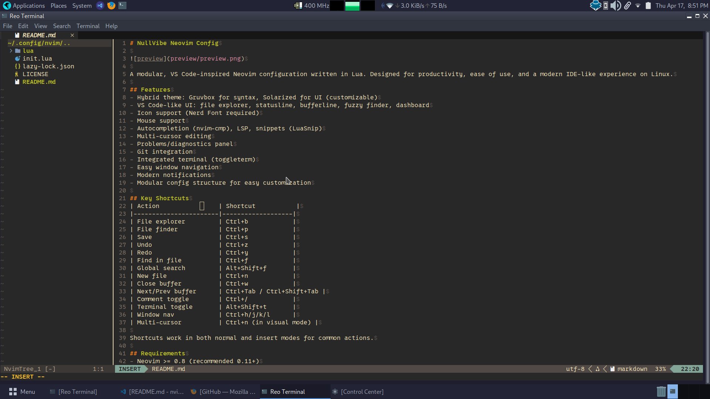

# NullVibe Neovim Config



A modular, VS Code-inspired Neovim configuration written in Lua. Designed for productivity, ease of use, and a modern IDE-like experience on Linux.

## Features
- Hybrid theme: Gruvbox for syntax, Solarized for UI (customizable)
- VS Code-like UI: file explorer, statusline, bufferline, fuzzy finder, dashboard
- Icon support (Nerd Font required)
- Mouse support
- Autocompletion (nvim-cmp), LSP, snippets (LuaSnip)
- Multi-cursor editing
- Problems/diagnostics panel
- Git integration
- Integrated terminal (toggleterm)
- Easy window navigation
- Modern notifications
- Modular config structure for easy customization

## Key Shortcuts
| Action                | Shortcut           |
|-----------------------|-------------------|
| File explorer         | Ctrl+b            |
| File finder           | Ctrl+p            |
| Save                  | Ctrl+s            |
| Undo                  | Ctrl+z            |
| Redo                  | Ctrl+y            |
| Find in file          | Ctrl+f            |
| Global search         | Alt+Shift+f       |
| New file              | Ctrl+n            |
| Close buffer          | Ctrl+w            |
| Next/Prev buffer      | Ctrl+Tab / Ctrl+Shift+Tab |
| Comment toggle        | Ctrl+/            |
| Terminal toggle       | Alt+Shift+t       |
| Window nav            | Ctrl+h/j/k/l      |
| Multi-cursor          | Ctrl+n (in visual mode) |

Shortcuts work in both normal and insert modes for common actions.

## Requirements
- Neovim >= 0.8 (recommended 0.11+)
- [Nerd Font](https://www.nerdfonts.com/font-downloads) (for icons)
- [ripgrep](https://github.com/BurntSushi/ripgrep) (for search)

## Installation
1. Clone this repo to `~/.config/nvim`:
   ```sh
   git clone https://github.com/prabinpanta0/NullVibe-Neovim-Config.git ~/.config/nvim
   ```
2. Open Neovim and run `:Lazy` to install plugins.
3. Set your terminal font to a Nerd Font.
4. Restart Neovim.

## TODO / Roadmap
- [ ] Hybrid theme: fine-tune color overrides
- [ ] Settings page: UI and JSON editor for config
- [ ] More LSP servers and language-specific configs
- [ ] Custom snippets and snippet management
- [ ] Project/session management
- [ ] Transparency and advanced UI tweaks
- [ ] Keybinding editor (in-editor)
- [ ] More VS Code-like features (minimap, breadcrumbs, etc.)

## License
See [LICENSE](LICENSE).
